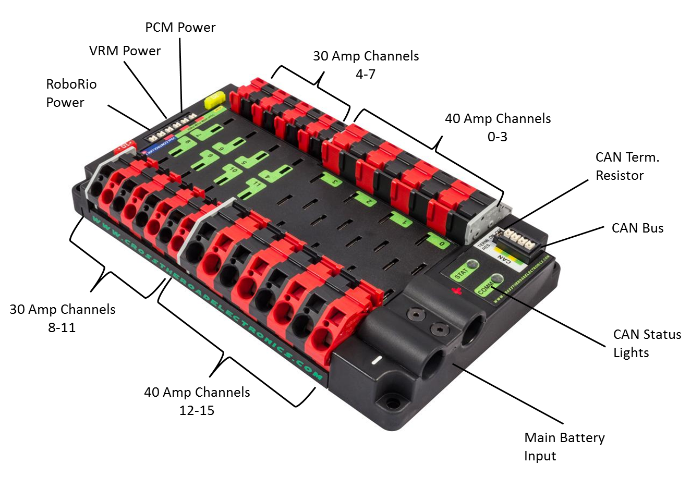

##Navigation
* These slides are organized by topic and run completely in your browser
* Press Left, Right, Up, Or Down to Navigate through the slides
* Press (Esc) to see the entire slide package
* Press (F) to full screen the presentation
  

> These are `cubed` slides when you see the **&#8659; More** Symbol, press the down key to move down to the next slide in the section.

  

> Once the section is finished, move to the right to continue to the next section of the presentation.

  

> The Navigation Icon in the bottom right corner will tell you which directions you can move.

---

##Agenda

* 1st half hour
  - Control System Basics
  - Getting Started
  - Tips/Ticks, Pitfalls
  - Resolving Issues
* 2nd half hour
  - Question/Answers
  - Mics. Discussions
  

---

##Objective

The objective of this presentation is to act as a crash course for the 2015 control system.

  

We realize teams will be receiving their kit of parts in a few weeks, and we want this presentation to be a "quick start" guide so teams can get started with their new control system immediately.

  

Towards the end of the presentation, we will discuss some of the more interesting items we have learned through Alpha and Beta testing the RoboRio over the past year.

--

##Kit of Parts

We don't know everything you will be getting, but we know each team will be receiving at least the following:

* 1 - RoboRio
* 1 - Power Distribution Panel
* 1 - Voltage Regulator Module
* 1 - Pneumatics Control Module
* 4 - Talon SR Motor Controllers

--

## 1 - RoboRio

<table>
  <tr>
    <td></td>
    <td>
       <ul>
          <li>Main computer for the Robot / Replaces the cRIO</li>
          <li>Runs on a dual-core ARM Cortex A9 Processor @ 667 MHz</li>
          <li>256 MB Random Access Memory (RAM)</li><li>512 MB Non-Volatile Memory (Flash)</li>
          <li>Supports USB 2.0 Devices</li>
          <li>Supports USB3.0 (at USB 2.0 Data rates)</li>
          <li>Runs the Linux Operating System, but has no monitors</li>
          <li>Incorporated previous cRIO, Analog module, digital module, and Digital Side car in one unit</li>
          <li>Supports C++, Java 8, and Labview 2015</li>
       </ul>
    </td>
  </tr>
</table>

  

--

##RoboRio

--

## 1 - Power Distribution Panel

<table>
  <tr>
    <td></td>
    <td>
       <ul>
          <li>Called Power Distribution Panel (as opposed to Power Distribution Board)</li>
          <li>All Output ports are unregulated (outputs direct battery voltage)</li>
          <li>Supports CAN interface monitoring of Voltage/Current/Temperature</li>
          <li>Built-in CAN terminal resistor jumper</li>
        </ul> 
     </td>
  </tr>
</table>

  

> The purpose of this panel is for Safety, all devices which require electrical power must receive it from this panel. If there is a short on the Robot, the corresponding breaker will trip.

--

##Power Distribution Panel

--

## 1- Pneumatic Control Module

<table>
  <tr>
    <td></td>
    <td>
       <ul>
          <li>Connected to Robot via CAN Bus</li>
          <li>Automatically turns on and off compressor</li>
          <li>Drives up to 8 solenoids</li>
          <li>Supports 12V or 24V output</li>
          <li>Built in fault monitoring</li>
          <li>add more PCM's as needed via CAN bus</li>
          <li>absents of Voltage jumper defaults to 24V (typo in image will fix soon)</li>
        </ul> 
     </td>
  </tr>
</table>

--

##Pneumatic Control Module

--

## 1 - Voltage Regulator Module

--

## 4 - Talon SR Motor Controllers

--

##Radio

Same D-link used in previous years. 
DAP-1522 Rev B.
  

--

---

##Quick Getting Started Guide

So now you have your Control System, how do you set it up?

--

##Wiring Diagram

--

##Wireing Diagram Correction

> Note on previous slide the Bridge device is wired incorrectly. It is showsn being wired into the USB port of the Roborio. This is a representation of the Alpha Control System not the 2015 System you Will be running.

  
For 2015: 
 
The bridge will receive its power from the VRM 5V 2A channel, and will connect to the RoboRio via an Ethernet Cable.

  

All other wireing is correct.

--

##Wiring the New 2015 System

* Much easier (Wieldmuler connectors remove the need for terminals)
* We use 18-2 wire for all control system interconnects (power and CAN) 
* We use 6 awg Battery Cables
* We use 22-2 cable for PWM cables (no center wire needed), solenoid wires, and 5V sensors 
* Buy in singles and spin your own http://www.mcmelectronics.com/content/en-us/landing_pages/hook-up-wire

--

##SoftWare OverView

The FRC Software Suite is required to be installed on a Windows 7 or 8 machine. All other platforms are unsupported.

The Software Provides the Following Items:

* Labview (For Labview Teams Only)
* NI Max (For Labview Teams Only)
* 2015 Driverstation (For all Teams)
* RoboRio USB Drivers (For all Teams)
* RoboRio Imaging Tool (For all Teams)
* Bridge Configuration Utility (For All Teams)
* Latest Firmware and Image for RoboRio (For All Teams)
* Installs mDNS resolver (For All Teams)

> Before Installing the software I recommend installing the full .net 4.0 from Microsoft directly, then running the FRC installation

  

> This does not include the development software for C++/Java teams, we will cover that next.

--

##Flashing and Imaging the RoboRio

The RoboRio software is provided in 2 parts: 

* Firmware
  - Bootloader, Safemode, and Roborio hardware firmware
* Image
  - FPGA, Linux Operating System, and Default configurations. 

--

##Firmware Upgrade

1. Power on Rio, Power light should be green
2. plug the Roborio into your computer with FRC tools installs via usb (typical USB printer cable)
3. navigate to the USB IP address using any browser which has the silverlight plugin
4. http://172.22.11.2
5. Login to the Roborio using `admin` user name, leave password blank
6. Select upgrade firmware on the RoboRio and browse to the latest firmware
7. Typically in c:/program files(x86)/national instruments/shared/firmware/FXXX/ (remove (x86) if on 32-bit windows)
8. The RoboRio will update the firmware, and if successful the new firmware version will be showed on the webpage. If not, just try again.

> The RoboRio will ship with a default firmware, but no Operating system from the Factory. You will need to flash and image it before you can use it in any capacity. 

--

##Firmware Webpage

--

##Image Upgrade

1. To image the RoboRio you must use the RoboRio imaging tool installed with the FRC tools
2. C:\Program Files (x86)\National Instruments\LabVIEW 2014\project\roboRIO (remove (x86) if on 32-bit windows)
3. Launch the RoboRio.exe file
4. Enter your team number, select format controller, and select the image you wish to use. click on Format
5. Formatting will take a few minutes, and once complete the program will notify you.
6. The new image version will show on the Image Tool
7. Verify the RoboRio Power is Green and Status light is off (that means all went well).

--

##Imaging Tool

--

##Configuring the D-link for Home use

1. Use the D-link configuration tool
2. C:\Program Files (x86)\National Instruments\LabVIEW 2014\project\Bridge Configuration Utility
3. Connect the D-link to your computer via an ethernet cable
4. Disable all wireless network interfaces
5. Set your team number and a password to use the D-link in AP mode

> This configuration enables DHCP and sets the D-link address to 10.TE.AM.1

--

---

##Establishing Comms to the RoboRio

New for 2015 you no longer need to set static IPs for any FRC device. All devices use the mDNS protocol.
  
After imaging the RoboRio with your team number you can use the mDNS address to locate the roborio
  
i.e. http://roborio-2168.local, replace 2168 with your team number. (3 digit teams DO NOT pad with zero)
i.e http://roborio-359.local, if you are team 359.

  

> Using mDNS allows you to switch between Ethernet, Wifi, or USB without modifying network settings.

--

##Establishing Comms to the RoboRio

When you get the RoboRio from the factory, the ethernet port is configured for dhcp. You can leave it in this setting, infact it is recommened by FIRST to do so. 

  

The D-link (after configuring with the Bridge Configuration Utility) will assign the RoboRio it's IP address, and you should use the mDNS name of the RoboRio to locate it.

  

Also leave your Driverstation network interface in DHCP mode as well.

  

The 2015 FMS field will also be set up this way (to use DHCP).

--

##Establishing Comms to the RoboRio

1. Set your DS computer to DHCP and connect to the D-link via Ethernet if the D-link is in Bridge Mode or Wifi if the D-link is in AP mode (FYI You can also connect to the RoboRio via USB)
2. Start the new DS application (installed with FRC tools)
3. Enter your team number in the DS application
4. Once connected, the Roborio should have Power light Green and Comm light Red
5. You have successfully established comms to the RoboRio
6. Now you need to program it

--

##RoboRio Status Lights

* Power
  - Green = Rio input voltage is acceptable
  - Orange = Rio input voltage is unacceptable
  - Off = Rio is not powered, voltage is less than 4V

* Mode
  - Solid Green = Robot in Teleop Mode
  - Solid Yellow = Robot in Auto Mode
  - Solid Red = Robot in Test Mode
  - Off = Robot in Disabled Mode

--

* Status
  - 2 Blinks Repeatedly = Error Detected in Software, RoboRio is put into Safe Mode Automatically, Re-image RoboRio using Imaging Tool
  - 3 Blinks Repeatedly = User Directed RoboRio to start in Safemode, Recycle Power to exit safemode and boot normally
  - 4 Blinks Repeatedly = Software Crashed Multiple times, Most likely running out of Memory during program run
  - Continuous Blinking  = Catastrophic Unrecoverable Error, FileSystem is corrupt, use Seial to Debug and Contact NI
  - Off - RoboRio booted up correctly, no errors
            
* COMM = green means robot code is running.  Red means comms with DS, but no robot code, or robot code crashed.

* RSL = solid means powered, but disabled.  Blinking means enabled.

* Radio = Inactive for FRC 2015

---

##General Programming

Labview Teams - Labview 2015
C++ - Eclipse Luna IDE C++ 11/14 Syntax support
Java - Eclipse Luna IDE with Java 8 SE Embedded Support

1. After imaging, Labview teams can begin programming immediately
2. C++/Java Teams need to install a few more applications

--

##C++/Java Programming Set Up

C++/Java teams need to download and install 3-rd party tools not provided by first to set up their programming environment

  

1. Install Java JDK 8 for your development computer (From Oracles Website)(needed to run eclipse*)
2. Install Eclipse Luna** (From Eclipse Website)
3. Install WPILib Eclipse plugin using Eclipse software installer official instructions on ScreenSteps Live
  
*C++ Teams only need the JRE, Java teams need JDK, but it doesn't hurt to install the JDK in all instances
**C++ Teams need to install Eclipse for C++ Development, and Java Teams need Eclipse for Java SE development. If you already have Eclipse for Java, you can just install the CDT plugin.

> It shouldn't matter whether you use 32-bit or 64-bit as long as the bitness of the JDK and Eclipse match in all cases, we use 32-bit in all cases (even on 64-bit host machines)

--

##Eclipse Plugins

Official Pre-KickOff Directions here [link](http://www.usfirst.org/sites/default/files/uploadedFiles/Robotics_Programs/FRC/Game_and_Season_Info/2015/Installing_Eclipse_C_Java_for_FRC_2015.pdf)

--

##Install JDK on RoboRio (Java Teams Only)

At this point C++ Teams are ready to deploy code, Java Teams need to do 1 more thing
  
Install the Java 8 JVM on the RoboRio - it is not included in the image or firmware

FIRST has created an easy to follow process that does all of the configurations for you, and runs the commands to build the JVM for you so that you do not need to be concerned with the details. Follow their directions below. 

###Official FIRST Procedure
Ensure RoboRio is flashed and Imaged to latest versions then continue with [Offical screensteps directions](https://wpilib.screenstepslive.com/s/4485/m/13809/l/243933-installing-java-8-on-the-roborio-java-only)

> Note: You will need to create an account on Oracles Website to complete this step.

--

##Initial Set Up Complete

All teams can program the Robot at this point

---

##Tips/Tricks and Pitfalls

We released our Beta Testing Website

  

http://controls.team2168.org

  

It contains almost everything we have learned, and advice when using this system, plus our own useful advice. It is setup as a FAQ style website to help you find the answers you need quickly.
  

We will be maintaining it throughout the rest of the off-season, and through the build season, so check it frequently.

--

##Tips/Tricks and PitFalls

* RoboRio Webpage
  - You can use the webpage to confirm all interface devices
  - You can use the webpage to read all can devices status and faults
  - You can use the webpage to explore the filesystem and cpu/memory usage
  
* RoboRio SafeMode
  - Hold reset button until status light is enabled, then release
  - System will load a clean/default Linux file system in RAM to help debug any issues
  - You can re-image the RoboRio from safemode to fix any problem with the normal filesystem
  
* LED Lights
  - Use LED lights on RoboRio to determine system status

--

##Tips/Tricks and Pitfalls

* You can access the file system in 1 of 4 ways
  - WebDav (website file system)
  - SFTP (allows the transfer of files using a browser client like FileZilla)
  - SSH (allows full shell access to the linux filesystem)
  - FTP (it is possible, but avoid using, because anonymous FTP permissions)

> Note: Be careful when transferring windows text files to the RoboRio. Windows line endings are not the same as Linux line endings and will cause the file to be interpreted incorrectly. Eclipse can convert between line endings. So can Notepad++ don't use MS Notepad!

--

##Tips/Tricks and Pitfalls

* Viewing Live Program Output while running Java/C++
   - Use RioLog view in Eclipse to see netconsole output
   - Uses UDP (just like cRIO) to send data to any connected device
   - All output is also stored locally in a log file for later viewing (file is overwritten each time the RoboRio is started or Deployed??)

--

##BownOut Condition of Robot

* When the Battery dips below 6.8 Volts the RoboRio enters into a brownout state
  - Rio systematically starts to shut down system
  - At 6.8V all motor controller output is lost
  - At 6.2V all 5V and 3.3V sources are lost
  - Full list of events on team website
  
* New Power API in Labview/Java/C++ allows user to query state of hardware
  - boolean results if pins are disabled due to brownout
  - the user can also query each user rail supply for its voltage and its status (bad input, ok, over current, etc)
  - are in the process of Beta testing these
  - prevent control loop windups!!!
  
* RoboRio Input pins still read inputs down to 4V, so if your sensors are powered from an external source you will not lose sensor readings

--

##Pneumatics Control Module

* Compressor is wired directly to the PCM (do not use a spike in-between)
* Digital pressure switch is wired directly to the PCM
* Supports 24V or 12V via a jumper
* If you need to use 12 and 24V solenoids 2 PCMs will be required
* Refer to official rules for how to wire 2nd PCM

--  

##Voltage Regulator Module

* 5V and 12V 2Amp source
* 5V and 12V 500mA Sources
* Through testing we have learned (as well as others) to not exceed 1.5 amps continuous draw on any of the rails
* Shared Fuse with PCM
* D-link power
  - We have not blown the fuse through normal use, however it is possible to blow the fuse through shorting VRM wires, etc.
  - If the rules allow, we recommend powering the D-link from a VRM not installed in the VRM power port (i.e. One of the 30A channels)
  - Do not power any other device from the 5V rail the D-link power is connected too.
  
--

##Internet and Packages

* You can connect the RoboRio to the internet, and even install additional software on it
* First/NI does not limit the filesystem at all, so you are the admin
* Ships with OPKG package manager and a default repo from NI with packages configured for NI RT Linux
* Directions to install the Angstrom Repo on the RoboRio are on our beta website. This will give access to over 5000 packages compatible with the Rio

--

##New Motor Controllers

* Victor SP and Talon SRX
  - Aluminum Body (heat sink)
  - completely sealed (no debris)
  - hardwire inputs/outputs and signal wires
  
* Victor SP
  - PWM Only
  
* Talon SRX
  - CAN
  - PWM - 2 wire
  - Onboard PID and Sensor Integration (Like Jags)

* All previous motor controllers Victors, Talons, Jag are still supported.

---

##Resolving Issues

* The Status lights on all hardware is very useful. In general green is good and red is bad
* CAN on PCM and PDP will flash red if not connected properly
* RoboRio Status light indicates Error with RoboRio
* Fault codes are stored for all CAN devices, and can be viewed on the website
* If you crash filesystem on RoboRio, You can try to recover by placing in safemode, and re-imaging  
